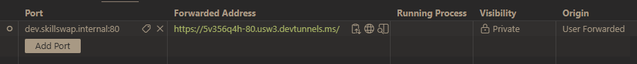

# skillswap

## Project Structure

The `project` directory contains two primary subdirectories: [frontend](./project/frontend) and
[backend](./project/backend). Each subdirectory has its own `README.md` file that provides detailed information about
the respective component. The reverse proxy configuration is also stored under the `project` directory, in the
[nginx](./project/nginx) folder.

## Quick Start

### Cloning the Repository

If you do not have [Git](https://git-scm.com/) installed, please follow the [Git installation guide](https://git-scm.com/book/en/v2/Getting-Started-Installing-Git) for your operating system.

You will need to authenticate with GitHub to clone the repository. A common way to do this is using an SSH key. If you
do not have an SSH key set up, reference [GitHub's official guide](https://docs.github.com/en/authentication/connecting-to-github-with-ssh/generating-a-new-ssh-key-and-adding-it-to-the-ssh-agent).

Clone the repository using the following command:
```bash
git clone git@github.com:ttc-2025-bpa-wdt/skillswap.git
```

This will create a local copy of the repository in a directory named `skillswap`. It will contain the entire project
structure with its respective source code and configuration files.

### Installing Dependencies

There is no development environment in this project. To get started with development you will need to have
[Docker](https://www.docker.com/) installed. This is commonly done through installing
[Docker Desktop](https://www.docker.com/products/docker-desktop/) (*recommended*), or following the
[Install Docker Engine](https://docs.docker.com/engine/install/) guide for your operating system (*for advanced users*).

We recommend using [Visual Studio Code](https://code.visualstudio.com/) as your editor, although it is not required.
For a better development experience, we populated [.vscode/extensions.json](./.vscode/extensions.json) with extensions
that are useful for working with this project. You can install these extensions by opening the Command Palette
(`Ctrl+Shift+P`), selecting `Extensions: Show Recommended Extensions`, and installing the listed extensions.

While not strictly necessary, we recommend installing [Bun](https://bun.sh/) to assist with managing dependencies for
the frontend and backend projects on your host machine. This will allow you to add dependencies to the projects without
having to manually edit the `package.json` files. Follow the [Bun installation guide](https://bun.sh/docs/installation)
for your operating system

### Deploying the Stack

If you do not have access to run your server with port `80`, you will need to set the `HOST_PORT` environment variable
in one of the methods described in the [Port Configuration](#port-configuration) section.

To start the development stack, run the following command in the root directory of the repository:
```bash
docker compose --profile dev up --build
```

This command will build the necessary Docker images and start the containers defined in the `dev` profile of the
Docker Compose configuration. If the command fails due to a connection problem, make sure that Docker is running on your
system.

### Accessing the Application

The NGINX reverse proxy is configured to route requests based on the host header. We recommend using the `Ports` feature
in Visual Studio Code to map the internal Docker ports to your host machine for easier access. You can also configure
a DNS server or hosts file to resolve the Docker hostnames on your machine, but we recommend using the `Ports` feature
for simplicity.

You will need the [Remote - Tunnels](https://marketplace.visualstudio.com/items?itemName=ms-vscode.remote-server)
extension installed in Visual Studio Code to use the `Ports` feature. Once you have the extension installed, simply
open the `Ports` view in the sidebar, and add your Docker hosts.




## Docker Configuration

The project components are containerized using [Docker](https://www.docker.com/). The containers are orchestrated using
[Docker Compose](https://docs.docker.com/compose/). This allows for our servers to be portable and non-dependent on
specific host configurations.

Each project contains its own Docker configuration files under their `docker` subdirectories, however the Docker Compose
file responsible for orchestrating the entire project is located in the root directory of the repository at
[compose.yaml](./compose.yaml). This includes all compose files in the root `docker` directory, which separates
development from production configurations.

Currently, there are two Docker Compose profiles available:
- `dev` - Runs a live [Vite](https://vite.dev/) server through [Astro](https://astro.build/) for the frontend and serves the host `dev.skillswap.internal`.
- `live` - Runs a built version of the frontend and serves the host `skillswap.internal`.

> [!IMPORTANT]
> Currently, only the `dev` profile is implemented. The `live` profile is planned for future development. If you run the
> `live` profile, NGINX will serve a **Bad Gateway** error as there is no server running to proxy requests to.

### Port Configuration

Both Docker configurations will expose the reverse proxy to either the port `HOST_PORT` (environment variable). If this
variable does not exist, it will default to port `80`. If you wish to change this (*and you may need to if you are
running without administrative privileges*), you can set the `HOST_PORT` environment variable to your desired port
number before running the Docker Compose commands.

You can set the `HOST_PORT` environment variable using three different methods:

1. **Using a `.env` file** (*recommended, persistent*) in the root directory of the repository:
    ```env
    HOST_PORT=8080
    ```
2. **Using shell environment variables** (*Linux/WSL, temporary*):
    ```bash
    export HOST_PORT=8080
    ```
3. **Exporting shell environment variables** (*Windows, temporary*):
    ```powershell
    $env:HOST_PORT="8080"
    ```

### Adding Dependencies

One disadvantage of using Docker is that adding dependencies does not reflect immediately in the running containers,
unless you rebuild them. To prevent confusion, the following section outlines the recommended workflow for adding
dependencies without having to rebuild everything from scratch.

1. **Add the dependency** to the respective `package.json` file in either the
    [frontend](./project/frontend/package.json) or [backend](./project/backend/package.json) directory. This should
    be done by running the following command in the respective directory:
    ```bash
    bun add <dependency-name>
    ```
2. **Run `bun install`** in the container that requires the new dependency. You can do this by executing the following
    command:
    ```bash
    docker compose exec <container-name> bun install
    ```
3. (*Optional*) **Rebuild the container** if you want to ensure that the dependency is included in the Docker image. You
    can do this by running:
    ```bash
    docker compose build <container-name>
    ```

> [!TIP]
> You can find `<container-name>` by executing `docker ps --format '{{.CreatedAt}} | {{.Names}}'` and looking for either
> the `frontend` or `backend` service. It will look like `<repo>-<profile>-<service>-X` (e.g., `skillswap-dev-frontend-1`).
> If you have Docker Desktop installed or use Docker extensions in your editor, you can also find the container names
> there.

